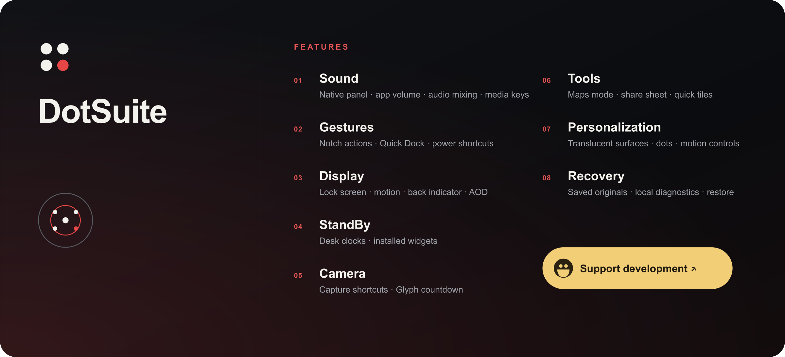

<p align="center">
  <a href="https://github.com/Wiojelt/dotsuite/releases"><strong>Download</strong></a>
  &nbsp;&nbsp;·&nbsp;&nbsp;
  <a href="https://buymeacoffee.com/wiojelt"><strong>Buy me a coffee</strong></a>
  &nbsp;&nbsp;·&nbsp;&nbsp;
  <a href="https://github.com/Wiojelt/dotsuite/issues"><strong>Issues</strong></a>
</p>

## Features

- Native volume panel controls, per-app volume and audio mixing
- Volume-key actions and screen-off media controls
- Notch gestures, Quick Dock and power-button shortcuts
- Lock-screen, motion, back-indicator and always-on display controls
- StandBy clocks and widgets
- Camera shortcuts and Glyph countdown
- Minimal Maps mode, share-sheet controls and quick settings tiles
- Local diagnostics with reversible system changes

Each feature shows the access it needs before it is enabled.

## Build

```powershell
./tools/Get-GlyphSdk.ps1
./gradlew.bat :app:assembleDebug
```

Issues and pull requests are welcome.

[Credits](NOTICE.md) · [MIT License](LICENSE)
